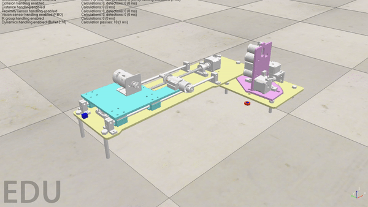

## SMFG Final Project - Automated Sander

Authors: Aaron Bursten & Brad Sisson

<H3> Intro </H3>
This Automated Sander is manufactured for TOKA Branding Co. The 
Automated Sander will Automate a work cell that currently is manned by an employee at TOKA
Branding Co. The current work cell task includes the finishing portion of the manufacturing process, the
work is sanded by an employee before it moves to the next workstation. TOKA Branding believes that
this could be easily automated and the current manpower used in this station could be utilized elsewhere
more efficiently. The Automated Sanding Station will increase productivity because it will free up
employee resources to work on other more important tasks. The Automated Sander will also increase
production speed and decrease employee fatigue.

<H3> Deliverables </H3>

1. Cycle time of 60 seconds or less 

2. External IO Compatible for future expansion 

3. Efficiently switch between sanding of different size jars 

4. Easy/fast loading and automated unloading 

5. Single push button actuation 

<H3> CAD Model </H3>
Software: Solidworks 

<H3> Electrical Schematics </H3> 
Software: Fusion Eagle 

<H3> Hardware Architecture </H3>

<H3> Software Architecture </H3>

<H3> Code for Arduino </H3>
<a href="Arduino Code"> Here is the code that we used to program the Arduino </a>

<H3> Video of Robot </H3>

<H3> Simulation of Robot </H3>

